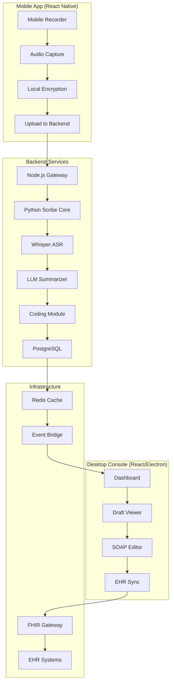

# AI Medical Scribe MVP

A comprehensive AI-powered medical documentation system with mobile recording and desktop review capabilities.

## 🏗️ Architecture



## 🚀 Quick Start

```bash
# Clone and setup
git clone <repo-url>
cd medai

# Start all services
docker compose up -d

# Mobile app (iOS/Android)
cd mobile && npm install && npx react-native run-ios

# Desktop console
cd web && npm install && npm start

# Backend development
cd backend && npm install && npm run dev
```

## 📁 Project Structure

```
medai/
├── mobile/                 # React Native app
├── web/                   # Desktop console (React/Electron)
├── backend/               # Node.js + Python services
├── infra/                 # Docker, k8s, terraform
├── shared/                # Common types & utilities
└── docs/                  # API docs, architecture
```

## 🎯 Key Features

- **Mobile Recording**: Cross-platform voice capture with offline buffering
- **AI Processing**: Whisper ASR + LLM summarization with SOAP structure
- **Desktop Review**: Interactive draft editing with confidence indicators
- **EHR Integration**: FHIR-compliant sync with major EHR systems
- **Compliance**: GDPR-ready with EU data residency and audit trails

## 📊 North Star Metric

**Target**: ≥30 minutes of documentation saved per doctor per day

## 🔒 Security & Compliance

- AES-256 encryption at rest
- TLS 1.3 in transit
- EU data residency (eu-central-1)
- HIPAA/GDPR compliant audit trails
- PHI never logged or stored in plain text

## 🧪 Testing

```bash
# Unit tests
npm run test

# E2E tests
npm run test:e2e

# Mobile tests
cd mobile && npm run test
```

## 📈 Future Roadmap

- Analytics dashboard for clinic metrics
- Admin panel for clinic management
- Advanced pricing tiers with feature flags
- Multi-language support (i18n)
- Real-time collaboration features 